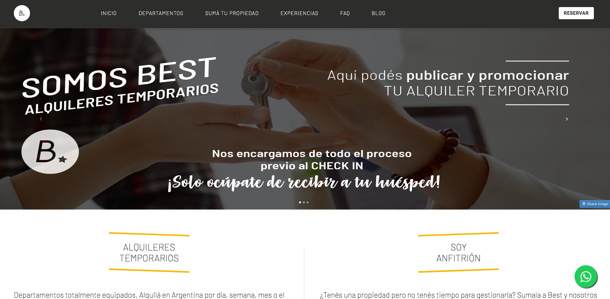

# Best Alquileres - Temporary rental website

Responsive website created with Node.js, React and Firestore.
## Table of Contents

* Introduction and description
* Status
* Setup -DONE
* Technologies -DONE
* Illustrations
* Launch
* Examples of use
* Project status
* Authors -DONE

## Introduction and description

This is the first official website for Best Alquileres, a temporary rental company based in Argentina. The client wanted to have a website where they could upload different apartments 

## Status and TBDs

Due to the client's unexpected need to launch sooner than originally planned (deadline moved to January 31st, 2021), the current version of the project fully delivers on all of the client's needs, but there's plenty of room for improvement down the road.

- What works
- What is not finished
    * Grid images sizes and positions, due to uploaded images having no standard size.
    * Being able to trigger Lightbox from custom button.
- 

## Setup
To run this project, install it locally using npm:

```
$ cd ../bnbestweb
$ npm install
$ npm start
```

## Illustrations



## Technologies

Project is created with:
* Javascript - 1.7 in Chrome
* React - 17.0.1
* Firebase - 8.2.3
* Bootstrap - 4.5.3
* Multiple libraries...

## Authors

Carlos Miceli (Github, Linkedin, personal website):
* Conditional rendering
* State management
* Database management and requests
* Cloud-hosting setup
* Responsiveness
* Automations
* Final design
* Final style

Florencia Galindo (Github):
* Initial design
* Initial style
* Firestore setup
* Google Maps and Lightbox libraries setup